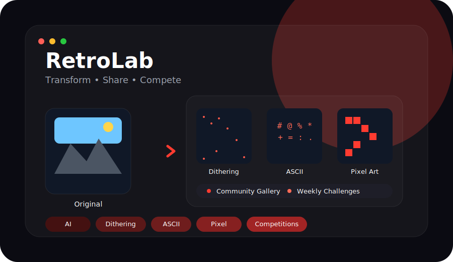
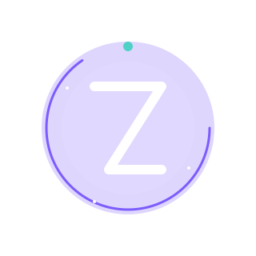

<!-- ========================================================= -->
<!--                  ZAID SAIFI • GITHUB PROFILE              -->
<!-- ========================================================= -->

  

<table>
<tr>
<td>

</td>
<td>

</td>
<td>

</td>
<td>

</td>
</tr>
</table>

---

<table>

<tr>

<td width="33%" align="center">

## Design

I enjoy creating interfaces that feel effortless, elegant and intentional.

</td>

<td width="33%" align="center">

## Engineering

Building scalable products with modern architecture and clean code.

</td>

<td width="33%" align="center">

## Intelligence

Using AI to build products that solve meaningful real-world problems.

</td>

</tr>

</table>

 

---

 

# Hello.

I’m **Zaid Saifi**, a frontend engineer passionate about creating products that blend engineering, design, and artificial intelligence into seamless user experiences.

I enjoy turning ambitious ideas into polished applications—whether it's designing immersive interfaces, architecting scalable systems, or building AI-powered products that people genuinely enjoy using.

Rather than focusing only on features, I focus on creating products that feel intuitive, performant, and memorable.

 

---

# What I Believe

<table>

<tr>

<td width="50%">

### Simplicity is engineered.

Simple products are rarely simple to build.

Thoughtful architecture, reusable systems, and careful iteration create experiences that feel effortless.

</td>

<td width="50%">

### Motion has meaning.

Animations should explain, guide, and improve usability—not exist for decoration.

Every transition should make the interface easier to understand.

</td>

</tr>

<tr>

<td width="50%">

### Design systems scale.

Components should be reusable.

Layouts should be predictable.

Consistency builds trust.

</td>

<td width="50%">

### Performance matters.

Beautiful interfaces should also load quickly.

Fast software is better software.

</td>

</tr>

</table>

 

 

# Currently Exploring

<table>

<tr>

<td align="center">

🧠

### AI Products

Building AI-native software that feels useful instead of gimmicky.

</td>

<td align="center">

✨

### Motion Design

Crafting interfaces inspired by Apple, Linear and modern product design.

</td>

<td align="center">

⚡

### Frontend Architecture

Reusable systems, scalable components, accessibility and performance.

</td>

</tr>

</table>

 

---

> *"The best interfaces disappear.
Only the experience remains."*

 

<!-- ================= PART 1 ENDS HERE ================= -->
<!-- ================= PART 2 : FEATURED WORK ================= -->

 

# Selected Work

### Products built with engineering, interaction design, and AI.

 

<table>
<tr>

<td width="100%">

 

## FinTrac AI

### Financial Intelligence Operating System

Instead of showing charts, FinTrac helps people understand what to do next.

It combines transaction intelligence, behavioral analysis, forecasting, and AI recommendations into one decision engine.

 

**Highlights**

- AI-powered financial insights
- Smart categorization
- Recommendation Engine
- Financial forecasting
- Modern dashboard
- Beautiful UX
- Explainable AI

 

**Stack**

`Next.js`
`TypeScript`
`Tailwind`
`Supabase`
`Clerk`
`AI`

</td>

</tr>

</table>

  

<table>
<tr>

<td width="100%">

 

## RetroLab

### Creative Image Processing Platform

RetroLab transforms ordinary photos into nostalgic digital artwork.

Generate **ASCII**, **Dithering**, **Pixel Art**, and other retro-inspired styles, then share your creations with the community, participate in weekly challenges, and discover work from other creators.

 

**Highlights**

- Image transformations
- ASCII Generator
- Dithering Engine
- Pixel Art
- Community Gallery
- Weekly Challenges
- Image Sharing Platform

 

**Stack**

`React`
`TypeScript`
`Canvas`
`WebGL`
`Image Processing`

</td>

</tr>

</table>

  

<table>
<tr>

<td width="100%">

 

## SalesSphere

### Enterprise Sales Intelligence

SalesSphere transforms raw sales data into meaningful business intelligence through interactive dashboards, analytics, and performance monitoring.

Designed to demonstrate enterprise frontend architecture and large-scale data visualization.

 

**Highlights**

- Interactive dashboards
- ETL pipeline
- KPI monitoring
- Revenue analytics
- Responsive charts
- Enterprise UI

 

**Stack**

`React`
`Vite`
`TypeScript`
`Tailwind`
`Recharts`

</td>

</tr>

</table>

  

<table>
<tr>

<td width="100%">

 

## Personal Portfolio

### Product Design × Engineering

A portfolio designed as an immersive product experience instead of a traditional website.

Inspired by Apple, Linear, Raycast, and Vercel with cinematic layouts, motion, and storytelling.

 

**Highlights**

- Scroll storytelling
- Motion design
- Case studies
- Responsive UI
- Design systems
- Product thinking

 

**Stack**

`Next.js`

`Framer Motion`

`Tailwind`

`TypeScript`

</td>

</tr>

</table>

 

---

 

# Every project begins with one question.

## "Will someone genuinely enjoy using this?"

Everything else follows from that.

 

---

 

# Design Process

<table>

<tr>

<td align="center" width="25%">

## 01

Research

Understanding the problem before writing code.

</td>

<td align="center" width="25%">

## 02

Design

Creating intuitive experiences and scalable systems.

</td>

<td align="center" width="25%">

## 03

Engineer

Transforming ideas into performant software.

</td>

<td align="center" width="25%">

## 04

Iterate

Ship.

Measure.

Improve.

Repeat.

</td>

</tr>

</table>

 

> Great products are never finished.
>
> They simply become better with every iteration.

 

<!-- ================= PART 2 ENDS HERE ================= -->
<!-- ================= PART 3 : TECHNOLOGIES ================= -->

 

# Tools I Build With

### Technology should serve the product, never become the product.

 

<table>

<tr>

<td width="25%" align="center">

## Frontend

React

Next.js

TypeScript

Tailwind CSS

Framer Motion

</td>

<td width="25%" align="center">

## Backend

Node.js

Express

Supabase

PostgreSQL

REST APIs

</td>

<td width="25%" align="center">

## Artificial Intelligence

OpenAI

Gemini

Hugging Face

Ollama

Prompt Engineering

</td>

<td width="25%" align="center">

## Design

Figma

Penpot

Motion Design

Design Systems

UI / UX

</td>

</tr>

</table>

 

> Every tool is chosen for a reason.  
> Simplicity is a consequence of good engineering.

 

<!-- ================= GITHUB ================= -->

 

# Engineering in Numbers

### Continuous learning through building.

 

 

 

<!-- ================= ACTIVITY ================= -->

 

# Activity

### Building consistently, one commit at a time.

 

 

<picture>

<source
media="(prefers-color-scheme: dark)"
srcset="https://raw.githubusercontent.com/zaid1234-11/zaid1234-11/output/github-contribution-grid-snake-dark.svg"/>

</picture>

 

<!-- ================= JOURNEY ================= -->

 

# Journey

### Every project teaches something new.

 

<table>

<tr>

<td width="25%" align="center">

## 2023

Started exploring

Frontend

HTML

CSS

JavaScript

</td>

<td width="25%" align="center">

## 2024

Built projects

Learned React

UI Design

Animations

</td>

<td width="25%" align="center">

## 2025

AI

Full Stack

Product Thinking

Design Systems

</td>

<td width="25%" align="center">

## 2026

Building products

Open Source

Scalable Systems

Meaningful Experiences

</td>

</tr>

</table>

 

> Learn. Build. Refine. Repeat.

 

<!-- ================= CURRENT ================= -->

 

# Current Focus

 

<table>

<tr>

<td width="33%" align="center">

## FinTrac AI

Building a financial operating system that helps people make better decisions instead of simply tracking expenses.

</td>

<td width="33%" align="center">

## RetroLab

Creating an image processing platform combining AI transformations, creativity, and community-driven competitions.

</td>

<td width="33%" align="center">

## Product Design

Improving interaction quality through thoughtful motion, design systems, and frontend architecture.

</td>

</tr>

</table>

 

<!-- ================= PART 3 ENDS HERE ================= -->
<!-- ================= PART 4 : CONNECT ================= -->

 

# Let's Build Something Meaningful

I enjoy collaborating on products that combine thoughtful design,
modern engineering, and artificial intelligence.

Whether it's an open source project,
a startup idea,
or simply exchanging ideas—

I'm always happy to connect.

 

 

# Beyond Code

<table>

<tr>

<td width="25%" align="center">

🎨

### Product Design

Designing interfaces that feel intuitive,
minimal,
and purposeful.

</td>

<td width="25%" align="center">

⚡

### Frontend

Creating fast,
responsive,
and accessible web experiences.

</td>

<td width="25%" align="center">

🤖

### Artificial Intelligence

Exploring practical AI systems
that solve meaningful problems.

</td>

<td width="25%" align="center">

🚀

### Continuous Learning

Always experimenting,
building,
and improving.

</td>

</tr>

</table>

 

 

# Current Mission

> Build software that people enjoy using.

> Design interfaces that disappear into the experience.

> Keep learning.

> Keep shipping.

 

 

  

# Zaid Saifi

### Frontend Engineer • Product Designer • AI Builder

 

*"The best products are remembered not because they are complex,
but because they make complexity disappear."*

  

<!-- ===================================================== -->
<!--                  THANK YOU FOR SCROLLING               -->
<!-- ===================================================== -->

<!--

If you're reading the source...

Welcome 👋

You looked beyond the interface.

A few hidden notes:

ZX-11

FT-01

RL-07

SS-04

PF-09

Every project here started with curiosity.

Every animation has a purpose.

Every SVG was handcrafted to tell a story.

The goal was never to build another GitHub profile.

The goal was to build a product experience.

See you in the next commit.

-->

<!-- ====================== END =========================== -->