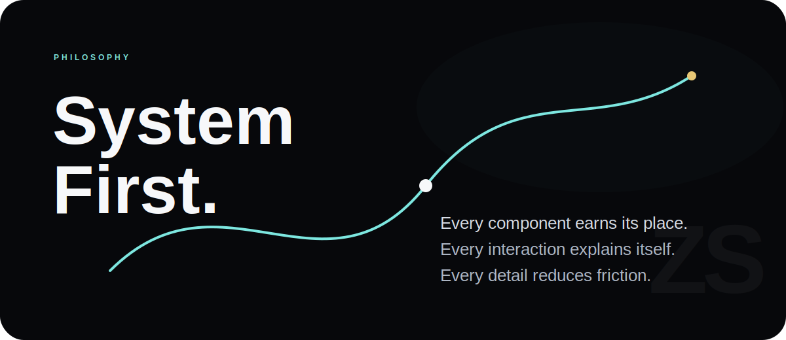
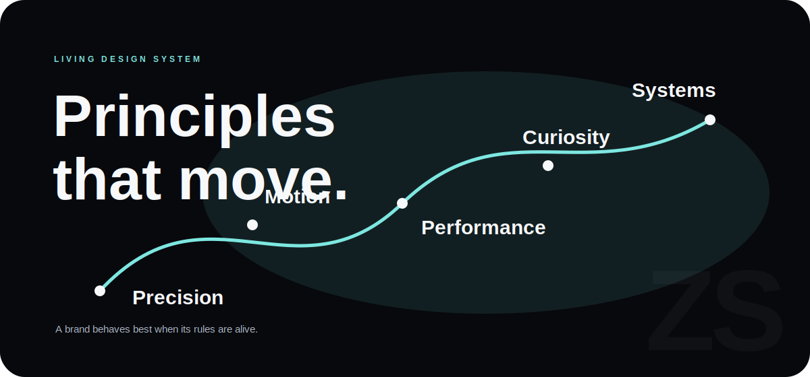
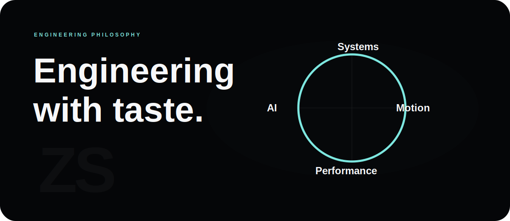
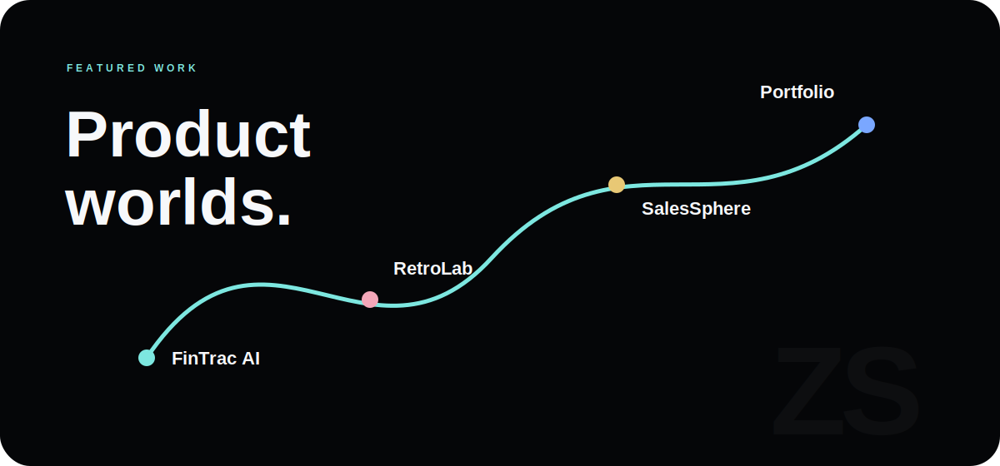
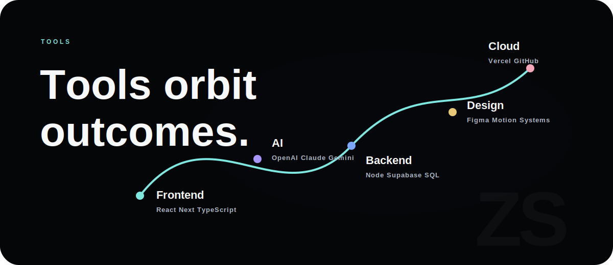
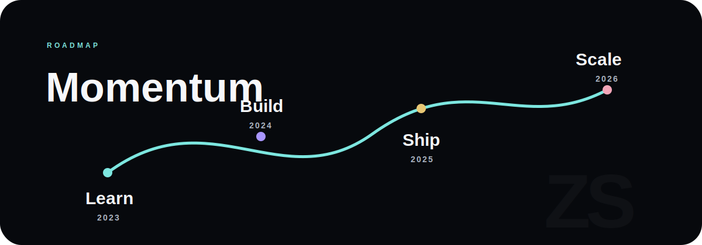
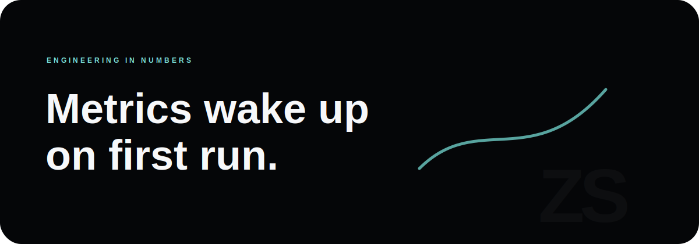
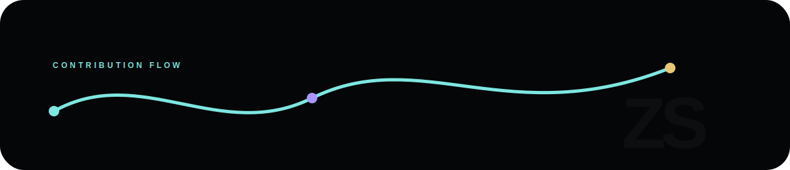
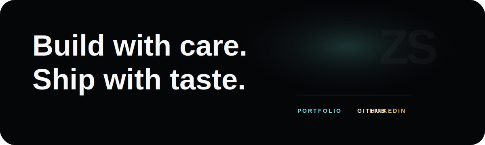

<!--
  Quiet Intelligence.
  A profile built as a product surface, not a template.
  Inspectors: the SVG source holds the details.
-->

  

  

  

  

  

  

  

  

  

  

  

  

  

  

  

  

  

  <a href="https://www.zaidsportfolio.in">Portfolio</a>
  &nbsp;&nbsp;
  <a href="https://github.com/zaid1234-11">GitHub</a>
  &nbsp;&nbsp;
  <a href="https://www.linkedin.com/">LinkedIn</a>

  

<!--
  Last pass rule:
  Remove anything that does not increase trust, clarity, or craft.
-->
